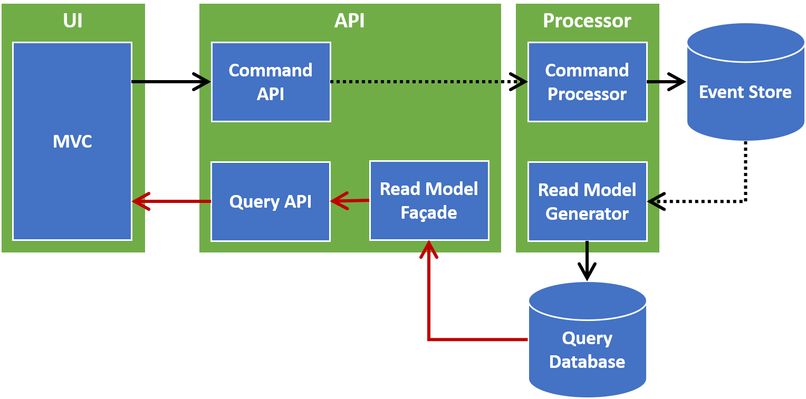

# FoxOffice

**CQRS Sample Program**

This sample program shows how to build a distributed cloud .NET Core application based on CQRS and Event Sourcing.

## Architecture



## How to execute the applications locally

### Install and run Azure storage emulator and Cosmos DB emulator

- [Azure storage emulator](https://docs.microsoft.com/en-us/azure/storage/common/storage-use-emulator)
- [Cosmos DB emulator](https://docs.microsoft.com/en-us/azure/cosmos-db/local-emulator)

### Create a local settings file for the function app

Create `local.settings.json` file in the directory `./source/FoxOffice.Processor` to execute the function app on local machine.

```json
{
  "IsEncrypted": false,
  "Values": {
    "AzureWebJobsStorage": "UseDevelopmentStorage=true",
    "FUNCTIONS_WORKER_RUNTIME": "dotnet"
  },
  "ConnectionStrings": {
    "Storage": "UseDevelopmentStorage=true"
  },
  "Messaging": {
    "Storage": {
      "QueueName": "messages"
    }
  },
  "Domain": {
    "Storage": {
      "EventStoreTableName": "FoxOfficeEventStore"
    }
  },
  "ReadModel": {
    "CosmosDb": {
      "Endpoint": "https://localhost:8081",
      "AuthKey": "C2y6yDjf5/R+ob0N8A7Cgv30VRDJIWEHLM+4QDU5DE2nQ9nDuVTqobD4b8mGGyPMbIZnqyMsEcaGQy67XIw/Jw==",
      "DatabaseId": "FoxOfficeDatabase",
      "CollectionId": "FoxOfficeCollection"
    }
  }
}
```

### Open the solution

Open the solution `./source/FoxOffice.sln` in Visual Studio.

If Visual Studio is not installed on your local machine you can download Visual Studio community edition [here](https://visualstudio.microsoft.com/downloads/). It's free for students, open-source contributors, and individuals.

### Set startup projects

1. Select the menu **'Project'** **>** **'Set Startup Projects...'**.
1. Select **'Multiple startup projects'** radio button.
1. Select Action of **'FoxOffice.Processor'** to **'Start'**.
1. Select Action of **'FoxOffice.Api'** to **'Start'**.
1. Select Action of **'FoxOffice.Admin'** to **'Start'**.

### Start debugging

Select the menu **'Debug'** **>** **'Start Debugging'**.
